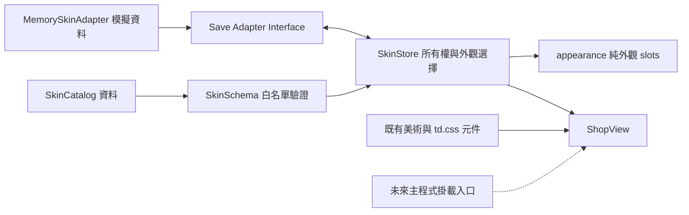

# HERO FRONTIER 外觀商城

> **v0.84.7 現行商城：** 四位英雄外觀（獸人為「冥骨帝王」）與「日蝕王庭」已開放使用玩家檔案的試用水晶購買、保存與裝備；沒有真實付款。詳細規格、操作、限制、部署與測試見 [外觀上架交付](../COSMETIC_RELEASE_V0847.md)。

> 大酋長的最新試裝頁已由商城商品連結接入；雷霆戰王只保留立繪初稿，不販售。比較頁返回遊戲內商城。整合狀態見 [跨分支盤點](../CROSS_BRANCH_INTEGRATION_AUDIT.md)，原始試裝設計見 [0.5.0 文件](CHIEF_LAB_V050.md)。

以下保留 0.4.0 展示版的歷史說明；現行操作以 v0.84.7 交付文件為準。

> v0.84.4：霜華、曜陽、緋月、赤燼與日蝕王庭是未推出預覽，無購買入口；特效分類顯示敬請期待。個人背景圖塊已可在大廳右上角頭像的個人頁籤免費試用，正式商城販售尚未推出。見 [本版交付](../EXPEDITION_SCORE_PROFILE_V0844.md)。以下 0.4.0 段落保留歷史展示行為。

> 主目錄整合狀態 v0.83.5：大廳已 mount ShopView 並在離開時 destroy；MemorySkinAdapter 保留展示模式，不寫正式錢包。以下版本記錄為分支歷史，最新主目錄行為以整合文件為準。 詳見 [商城與圖鑑整合交付](../FEATURE_INTEGRATION_V0835.md)。

分支歷史依序為 [0.5.0 大酋長試裝](CHIEF_LAB_V050.md)、[0.4.0 三英雄試裝](HERO_LOOKS_V040.md)、[0.3.0 換裝驗證](SKIN_FEASIBILITY_V030.md) 與 [0.2.0 視覺重製](VISUAL_V020.md)。

獨立分支 `feature/shop-ui`；入口 `shop.html`。只有外觀、模擬水晶與模擬收藏，不改變任何戰鬥、解鎖或故事結果。此為可整合的商城模組，尚未掛進另一分支的大廳 Navigation，裝備目前只影響商城選擇。

## 安裝與第一次啟動

1. 安裝 Node.js 18 以上、Git 及現代瀏覽器。一般執行不需 npm 套件、API Key、帳號或資料庫。
2. 在包含 `shop.html` 的專案目錄執行 `node scripts/serve-test.js`。
3. 開啟 `http://127.0.0.1:4173/shop.html`，會看到 5,230 展示水晶。不要從既有戰鬥商城入口進入，兩者用途不同。
4. 若 4173 已使用，PowerShell 執行 `$env:TD_TEST_PORT='4187'` 後再啟動，網址改成 4187。
5. 停止本機伺服器：在其終端機按 Ctrl+C。沒有背景付款、資料同步或權限要求。

`shop.html` 亦使用傳統 script，沒有打包需求。建議以 HTTP 啟動，與瀏覽器測試環境一致。

## 使用者操作手冊

左側分類提供精選、Hero Skin、Faction Skin、Effect Skin、其他外觀與 Collaboration。按「我的收藏」只看已擁有項目；再次按下可解除。商品區可上下捲動，邊境典藏可左右滑、滑鼠拖曳或使用箭頭；支援方向鍵與 Home / End，選取後保留位置。霜華詳情可進入 skin-lab.html 查看前後四組動作比較。手機橫向維持獨立版面，點商品會開啟詳情，右上角 ✕ 或 Escape 返回商品。

商品卡顯示名稱、稀有度、價格與狀態；詳情可切換頭像、立繪、戰場角色、動作、召喚物等項目。「原版」表示資產未提供，會沿用原版，不假裝播放尚未製作的 VFX 或語音。動作預覽使用既有圖集第一列；尊重系統減少動態效果設定。

按「模擬購買」→ 確認後只扣展示水晶並加入收藏。取消不扣款。購買後另按「裝備外觀」，可再「卸下外觀」。已擁有項目不會重複收費。鎖定項目顯示原因，聯名價格顯示待公布。新頁面或重新整理會重設水晶、收藏與裝備；這是記憶體展示的預期行為。

## 管理者手冊與設定

商品資料位於 `src/td/shop/SkinCatalog.js`，修改後重新整理即可。分類、價格、targetId、rarity、slots 均由資料驅動；不要加入能力或進度欄位。圖片必須是已存在的本機 `assets/` 相對路徑，禁止任意 URL、路徑穿越及執行函式。

展示預設資料在 `MemorySkinAdapter` 建構參數：`balance: 5230`，已擁有 `verdant-watch`、`silverleaf-oath`，已裝備 `hero:hunter → verdant-watch`。需要不同測試狀態時傳入完整 seed；不必調整 Save Core 或既有 localStorage。

沒有管理員後台、帳戶權限或可信賬本；此 adapter 的數據不能當作真實付費所有權。未接 Apple IAP、Google Billing、伺服器交易或真實金額。

## API 與 Skin Schema

全域 namespace 為 `FrontierShop`，不使用 `SkyStrike.skins` 或戰鬥 `ShopSystem`。

| 欄位 | 契約 |
| --- | --- |
| schemaVersion / cosmeticOnly | 必須為 `1` / `true` |
| id / targetId | 唯一商品 ID／外觀目標；小寫英文字母、數字、連字號 |
| name / subtitle / description | 非空文字，最多 500 字元；畫面輸出會跳脫 HTML |
| category | hero / faction / effect / other / collaboration |
| rarity | rare / epic / legendary |
| price | `{currency:'mock-crystal', amount:非負安全整數}` |
| availability | `{status:'available'或'locked', reason:文字}`；鎖定原因不可空白 |
| cover | image asset |
| slots | 此分類允許的外觀欄位；`null` 代表沿用原版 |

Hero slots：`portrait, selectionArt, battlefieldSprite, skillVfx, summonAppearance, animation, voice`。
Faction slots：`soldierAppearance, towerAppearance, banner, buildVfx, attackVfx`。
Effect：`skillVfx`；Other：`portrait, banner`；Collaboration：`selectionArt` 預留。每個分類只接受自己的欄位。

Asset：`{type, src}`。type 為 image、sprite、vfx、animation、voice；voice 使用 mp3/ogg，其餘 png/webp/jpg。sprite/animation 額外要求 `columns, rows, frames`；columns/rows 為 1–32，frames 為 1–columns。圖集預覽使用第一列。所有 asset/price/availability/skin 欄位均採白名單；ATK / HP / Drop / Score / Ranking 等額外欄位會拒絕。

```js
const ns = FrontierShop;
const adapter = new ns.MemorySkinAdapter();
const store = await new ns.SkinStore(ns.catalog, adapter).init();
const view = new ns.ShopView(container, store, { onClose: () => host.closeShop() });
// 卸載畫面時必須呼叫；不要攔截或覆寫 FrontierApp 的方法。
view.destroy();
```

載入順序：SkinSchema → SkinCatalog → SkinStore → ShopArt → ShopTemplates → ShopView。嵌入時不載入獨立入口 `main.js`。主容器須給可用大小；本版預設全視窗。樣式沿用 `td.css`，再載入 `shop.css`；商城規則 scoped 在 `.hf-shop`。獨立頁才使用 body 的 `cosmetic-shop-page` class。

| 方法 | 結果 |
| --- | --- |
| `schema.catalog(items)` | 驗證、複製、深度凍結 catalog；錯誤丟例外 |
| `store.init()` | 載入並驗證 adapter；失敗不覆寫存檔 |
| `snapshot()` / `get(id)` / `status(id)` | 狀態副本／不可變商品／available、owned、equipped、locked |
| `buy(id)` / `equip(id)` / `unequip(id)` | Promise；成功才發布新狀態，失敗維持原狀 |
| `appearance(category, targetId, base)` | 只回傳此分類 slots，缺漏回退 base；不回傳能力欄位 |
| `view.destroy()` | 移除事件、媒體查詢监听、對話框與內容 |

### Save Adapter Interface

`load(): Promise<State>`；`commit(nextState, expectedRevision): Promise<void>`。
State 只包含 `version:1, revision, balance, ownedSkins:string[], equippedSkins:Record<string,string>`。
裝備鍵為 `category:targetId`，每個目標只能選擇一套 skin；不同英雄／軍團互不覆蓋。版本、餘額、所有權與裝備關係會驗證。

commit 必須原子比較 revision 並保存整個 state；不相符或保存失敗時 reject，且不得部分寫入。Service 防止並行重複提交；Memory Adapter 提供 revision CAS 範例。未提供 localStorage Adapter，以免與正在修改的 Save Core 耦合。

後續由 Save Core 負責人實作 profile-scoped Adapter：以穩定 profile ID 隔離資料；玩家切換先 destroy 舊畫面，再為新玩家建立 Store，禁止全域共享收藏。新增 schema/state 版本時以明確遷移處理，不能靜默清空未知資料。base appearance 由受信任美術 manifest 提供，不能傳整個 combat entity。

## 系統架構圖與資料夾



`shop.html / shop.css`：入口、響應式 UI；`src/td/shop/`：Schema、Catalog、Store、View、入口與模組版本；`tests/td-cosmetic-shop.test.js`：資料與交易邊界；`scripts/qa-cosmetic-shop.cjs`：瀏覽器流程；`docs/shop/`：完整交付文件；`artifacts/qa-cosmetic-shop/`：驗證與截圖。

沒有資料庫或 HTTP API。Story、Unlock、Combat、Navigation、Save Core 均不依賴商城。未來只在呈現層接收 appearance 結果，不將 skin 傳入傷害、碰撞、冷卻、掉落、計分或排名計算。

## Audit 與設計決策

基底 `7f6fa5c`（package 0.79.2）。原工作目錄 `main` 存在大量未提交的 P0/P1 與戰鬥變更，包括未追蹤 `src/td/app/FrontierApp.js`、ProfileStore、StoryCatalog；商城 worktree 從已提交 HEAD 建立，未攜帶那些變更。

已檢查：`td.css` 共用 button、shop-button、panel-heading；`ShopSystem` 是戰鬥資源商城；`src/skins/SkinRegistry.js` 是另一射擊模式且自行寫入 localStorage；P0/P1 的 `FrontierApp` 商城目前為佔位頁。後兩者不宜直接繼承。商店以相同 CSS primitives、既有 opening 立繪／faction 美術與 sprite atlas 重用；沒有複製未提交的 P0 元件或 monkey patch 導覽。

參考圖採黑金奇幻商城語彙，實際使用現有角色美術。圖片中的儲值、禮包、首儲加倍不是本次授權功能。PC 為三欄，手機為兩欄瀏覽與點選詳情；不做 PC 整頁縮放。觸控按鈕至少 44px；支援 Safe Area、鍵盤關閉、購買對話框焦點、手機詳情焦點循環與 reduced motion。

## 部署手冊

本版不自動發布。不需要建置；以既有靜態主機供應完整 repository 及上述新檔，入口 `/shop.html`。不可只複製 HTML 而漏掉資產和 JS。發布環境可使用 HTTPS；本機測試 server 只綁定 127.0.0.1。

沒有修改 `sw.js`，商城不承諾离線預載或 PWA 安裝。待大廳與部署負責人整合時，再一併決定入口、資產快取與 Service Worker 版本；既有離線快取不自動包括新檔。

## 更新、版本與備份還原手冊

模組版本記錄在 `src/td/shop/version.json`；本次遞增為 `0.2.0`，不更改 P0/P1 正在遞增的 package 全域版本。後續功能遞增 minor、修正遞增 patch；Schema/State 破壞性改動另外提升版本並提供 migration。

一般更新：先備份本地修改，取得已審核 commit，在新的 worktree 套用並跑下方驗證。此分支不會 merge main。已有未提交變更的目錄不可直接切換或覆蓋。

保存上一版：記下 `git rev-parse HEAD`；可用 `git archive --format=zip --output=shop-backup.zip HEAD` 匯出已提交原始碼。還原驗證建議 `git worktree add ../shop-previous <上一版commit>`，不重設使用中的工作目錄。若已整合且只要撤銷商城，使用 `git revert <商城commit>` 並解決文件衝突，再重跑測試。

展示資料只在記憶體，重新整理就是還原初始狀態，不涉及遊戲進度；不要清空瀏覽器 localStorage 來重設商城。正式持久化備份／匯入須等 Save Adapter 實作，尚未提供 UI，不能當成目前已有能力。

## 測試清單

```powershell
node --test tests/td-cosmetic-shop.test.js
npm.cmd test
npm.cmd run check
# Browser QA 需要 Playwright（專案原有 QA 也使用此套件）。
npm.cmd install --no-save --package-lock=false playwright
$env:TD_TEST_PORT='4187'
node scripts/serve-test.js
# 另一個終端機，同一個工作目錄：
node scripts/qa-cosmetic-shop.cjs
```

QA 使用已安裝 Microsoft Edge。環境已有 Playwright runtime 時可用 NODE_PATH，無須安裝專案套件。可設定 `SHOP_TEST_URL` 指向其他本機入口。可選 WebKit：`npx playwright install webkit` 後設定 `$env:SHOP_WEBKIT='1'` 再跑；未執行不代表 Safari 通過。

- Schema 拒絕 gameplay 欄位、錯誤分類／價格、重复 ID、不安全資產來源。
- 五分類、Hero 七種／Faction 五種 slots、所有引用資產存在。
- 購買扣款一次、取消不扣款、Owned、Equipped、卸下、鎖定與餘額不足。
- 寫入失敗回復、並行防重複、revision 衝突、損坏存檔保留、不同目標外觀隔離。
- PC 1920×1080、1366×768；手機觸控 844×390、932×430（約 19.5:9）。
- 預覽、分類與收藏空狀態、重整重設、Safe Area 47px 左右／21px 下方、44px 主要操作。
- 頁面例外、Console error、HTTP 4xx/5xx 檢查；UI screenshot 人工檢視。
- 確認 git diff 不含 Story/Unlock/Combat/Navigation/Save Core，才 commit。

測試結果和剩餘限制見 [QA_REPORT.md](QA_REPORT.md)。

## FAQ

**為何大廳商城仍未開放？** 大廳導覽由 P0/P1 分支負責。本次入口是 `/shop.html`，提供掛載 API，未修改 Navigation Core。

**為何刷新後收藏消失？** Memory Adapter 模擬資料會重設，沒有寫入正式 Save。

**會改變英雄解鎖、戰鬥屬性或排名嗎？** 不會。Skin Schema 只有外觀欄位，商城沒有 Core reference 或遊戲儲存存取。

**新版美術包含哪些內容？** 0.2.0 已新增霜華公主等商城專用立繪與橫幅。戰場、動作與語音仍以原版 fallback 展示，未宣稱完整 Skin 美術套件已完成。

**水晶不足或資料已更新怎麼辦？** 展示版重新整理會回初始狀態；正式 Adapter 若发生 revision 衝突應重新載入，不可強制覆寫另一玩家／視窗資料。

**圖片無法顯示？** 確認根目錄與 assets 一起部署，檢查 URL 大小寫與 Network 404；畫面有中文預覽失敗提示。

**如何整合或回復？** 見 [MERGE_NOTES.md](MERGE_NOTES.md) 與上方更新還原程序。

## Skin Lab 0.3.1

施法改用獨立四格素材與足點，修正裁切／鄰格碎片，鏡頭保留完整光效空間。新增 PNG 必須隨版部署；API、操作、管理、更新回復、架構與測試見 [施法修正交付](CAST_FIX_V031.md)。Core、存檔與付款範圍不變。
