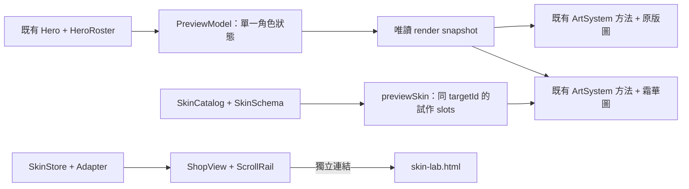

# 外觀商城 0.3.0：橫向典藏與霜華換裝驗證

日期：2026-09-21。分支 `feature/shop-ui`。上一版 `f0f4a8d`（0.2.0）。此版只更新商城、獨立 Skin Lab、美術、測試與文件，不修改 Story / Unlock / Combat / Navigation / Save Core。

## 產品決策與開發順序

1. 修復典藏第三張卡被壓縮且沒有橫向操作的問題。使用等寬卡、原生 overflow、箭頭、滑鼠拖曳與鍵盤；保留選取前的位置。
2. 查明角色 ID、正式圖集、動畫及裝備分層，再建立獨立比較頁；不把概念立繪當作已可在戰場使用的證明。
3. 以原版圖集為姿勢參考生成霜華動作試作，使用同一 Hero 狀態播放兩個 renderer。
4. 驗證 PC、手機橫向、觸控、降動態設定、失敗回退及數值隔離，再更新文件、版本與 commit。

## 使用與安裝

沿用 [商城安裝步驟](README.md)。伺服器啟動後進入 `/shop.html`，在霜華之誓詳情按「換裝前後比較」，或直接開 `/skin-lab.html`。

- 邊境典藏：手指橫滑、滑鼠按住拖曳、左右箭頭；聚焦典藏列可按 ← / →、Home / End。位於邊界的箭頭會停用。商品區仍可上下捲動。
- 比較頁：上方看選角立繪，下方同步切換待機／移動／攻擊／施法；可暫停、轉向、切換原尺寸。
- PC 為左右比較；手機橫向保持左右對照並垂直瀏覽，安全區使用 env(safe-area-inset-*)。
- 預覽不需購買、不消耗水晶、不保存狀態。返回商城會重新建立記憶體展示資料。

## Audit：現在能否真正換裝？

**可以，但此版是獨立可執行的呈現驗證，尚未完成正式戰場整合。**

| 項目 | 現況與接入要求 |
| --- | --- |
| 英雄身分 | HeroRoster 的 `arcanist` 名稱為森語者・希爾芙。沒有獨立銀葉公主 ID；銀葉公主是此次造型企劃名稱。若未來改名，仍保留穩定 targetId。 |
| 原版立繪 | `assets/td/opening/hero-arcanist-selection-v1.png`。目前立繪拿弓、戰場拿法杖長槍，這是既有素材差異，角色身分以 roster 為準。 |
| 原版戰場 | ArtSystem 的 `hero` 使用 `hero-actions-v1.png`。先前商城誤指向士兵 `arcanist-actions-v1.png`，0.3.0 已修正。 |
| 四組動作 | 圖集 4×4：idle / walk / attack / cast。Hero.update 決定 frame；idle 3 fps、walk 9 fps、attack 0.09 秒／格、cast 0.14 秒／格。 |
| 足點與切格 | ArtSystem.drawHero → drawFrame → SpriteFrameBounds / SPRITE_METRICS。新素材必須帶切格、可見高度與足點；不能只換大圖或 CSS 色相。 |
| 裝備分層 | 有武器時可改用 `hero-arcanist-actions-unarmed-v1.png` 加 class-weapons atlas。正式霜華要有對應無武器動作，否則裝備武器時可能變回原版衣服。 |
| 技能 VFX | HeroSkillVFX、Projectile 與 Hero.draw 的光效是不同呈現入口。此版只有動作圖內的光改藍，不改技能邏輯，也尚未換獨立技能特效。 |
| 召喚物 | 現有 arcanist 是元素守衛；白狼宣傳立繪不是已完成的召喚皮膚。換狼的外觀需另製同一召喚模型對應資產，不能改為另一單位規則。 |
| 名稱／其他商品 | 商城其餘商品仍為概念 mock，名稱、targetId 與素材的企劃配對需正式上線前確認；不可依宣傳名稱推斷角色 ID。 |

## 本版替換範圍

| Hero slot | 霜華狀態 |
| --- | --- |
| Portrait / Selection Art | 概念資產已存在；比較頁使用原版與霜華立繪。尚未接大廳。 |
| Battlefield Sprite / Animation | 新增 `frost-actions-prototype-v1.png`；僅 Skin Lab 使用，四組動作可同步播放。 |
| Skill VFX | 未提供；沿用原效果。圖內藍光不代表已接技能 VFX。 |
| Summon Appearance | 正式替換尚未提供；商城仍展示原版元素守衛。 |
| Voice | 未提供；沿用原版。 |

新圖由內建 image_gen 以原動作圖與霜華立繪生成，完整提示和來源見 [FROST_PROTOTYPE_MANIFEST.json](../../assets/td/shop/FROST_PROTOTYPE_MANIFEST.json)。原檔與原版素材均保留。此為可視化試作，邊緣、披風動作、攻擊發力、跨格特效、足點與裝備遮擋仍需逐幀美術驗收。

## 架構、資料夾與 API

`skin-lab.html` / `skin-lab.css` 是獨立入口與樣式。`src/td/skin-lab/PreviewModel.js` 負責真實 Hero 動作更新、唯讀 snapshot、renderer facade 與新圖 metadata；`main.js` 負責 UI 與 requestAnimationFrame。`src/td/shop/ScrollRail.js` 是可卸載的捲動控制元件。

- `previewSkin(FrontierShop)`：以原 schema 生成 frozen 試作資料，只替換 battlefieldSprite / animation 路徑；正式商城 catalog 不會被改成試作。
- `new PreviewModel(TowerFrontier)`：建立一個 arcanist；`setMotion(idle|walk|attack|cast)`、`advance(dt)`、`snapshot()`、`stats()`；`paused`、`facing` 僅為本頁控制。
- `createRenderer(engine, image)`：以 Object.create 重用 ArtSystem.prototype，避免 constructor 載入整場戰鬥圖；drawHero 使用相同唯讀角色 snapshot。
- `registerPrototype(engine)`：僅在比較頁註冊新圖片 key 的 bounds/metrics，原有 entries 不動。使用原圖足點及擴張 12px 的試作範圍；不代表完成美術逐幀驗收。
- `ScrollRail(root)`：原生觸控、mouse drag、keyboard、scroll 狀態；`restore(left)`、`step(direction)`、`destroy()`。ShopView.destroy 一併釋放事件與 ResizeObserver。

沒有新增資料庫、HTTP API、認證、存檔或付款需求；所有資產本機讀取。Schema / State 版本仍為 1。未建立正式 skin resolver 與 Core hook。

## 正式接入順序與驗收門檻

1. 由企劃確認「銀葉公主」是否為 arcanist 的別稱，並確認其他商品 targetId。
2. 美術補齊 hero armed/unarmed、逐幀 anchor/bounds、技能視覺、召喚視覺、語音與載入失敗 fallback。
3. 待另一分支穩定，由呈現層接 `SkinStore.appearance('hero','arcanist',baseSlots)`，以目標 ID 解析外觀。戰鬥資料、技能半徑、擊中時點、碰撞與攻擊規則保持原有 Core 決策。
4. 裝備、換英雄、死亡復活、召喚、暫停恢復、存檔載入皆重新解析正確外觀；不得全域替換 ArtSystem.hero 影響其他英雄。
5. 由 Save 負責分支實作 Adapter／CAS／profile 隔離。正式所有權不得取信前端 mock。
6. 使用相同輸入與亂數種子，對照有／無造型的整場戰鬥事件、傷害、掉落、分數、排名與存檔。此版未跑正式有皮膚的完整戰局，不能將呈現驗證當成其替代品。

## QA、維護、FAQ 與更新

執行 `npm test`、`npm run check`、`node scripts/qa-cosmetic-shop.cjs`、`node scripts/qa-skin-lab.cjs`。瀏覽器腳本需 `playwright` 與本機 Edge；可用 NODE_PATH 指到已有 Playwright runtime。網址可用 SHOP_TEST_URL / SKIN_LAB_TEST_URL 覆寫，預設 4187。

測試清單與證據見 [QA_REPORT.md](QA_REPORT.md)：典藏真正 overflow、右側卡完整可達、價錢完整、選取保留位置、拖曳不誤點、觸控滑動；前後四組動作16格同步、不同像素同數值、暫停／轉向／原尺寸、資產失敗明示回退、降動態設定與 console。

- 卡片看不到：上下移到典藏列，向右滑或按右箭頭。若按鈕停用，代表已到該側邊界。
- 換裝後為何戰鬥仍原樣：目前只有獨立比較頁，不是正式戰場裝備；商城內仍明示此限制。
- 右邊仍是原版：確認素材載入提示與部署是否包含 frost-actions-prototype-v1.png；缺圖會明示回退，不假裝已換裝。
- 為何沒有白狼／新語音：兩者尚未製作成可用替換資產。
- 手機字／操作被瀏海擋住：確認 viewport-fit=cover 及 skin-lab.css / shop.css 同版；另需實體 iPhone Safari 驗證。

部署須整批包含 shop.html、shop.css、skin-lab.html、skin-lab.css、src/td/shop、src/td/skin-lab 及 assets/td/shop。獨立頁讀取現有 namespace/config/HeroRoster/Hero/ArtSystem/SpriteFrameBounds。不得從本分支覆蓋另一分支正在修改的 Core。

版本只升商城至 0.3.0，不改遊戲 package.json。備份整個 commit 與新增美術即可，沒有需要備份的本頁持久玩家資料。回退至前版可另開 `f0f4a8d` worktree 或對本次 commit 執行 git revert；不要 reset 有未提交內容的主工作目錄。合併衝突與後續 hook 見 [MERGE_NOTES.md](MERGE_NOTES.md)。

## Skin Lab 0.3.1

施法改用獨立四格素材與足點，修正裁切／鄰格碎片，鏡頭保留完整光效空間。新增 PNG 必須隨版部署；API、操作、管理、更新回復、架構與測試見 [施法修正交付](CAST_FIX_V031.md)。Core、存檔與付款範圍不變。
