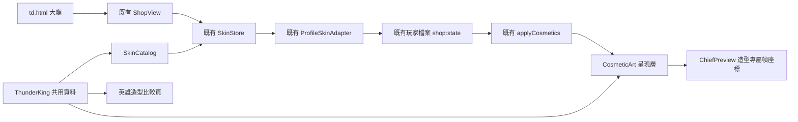

# 雷霆戰王正式商城接入 · 0.6.1

2026-09-22。以共享工作目錄的 `td.html` 現有商城為唯一正式來源；不再使用獨立展示商城。

## 玩家操作與影響

1. 開啟 `td.html`，從大廳按「商城」，或直接開啟 `td.html?panel=shop`。
2. 在精選或英雄造型選取「雷霆戰王」，花費 1,280 試用水晶，然後裝備。
3. 返回大廳並選擇大酋長・戈爾。選角立繪與正式戰場待機、移動、攻擊、施法都使用雷霆素材。
4. 比較頁仍先選英雄再選造型；「返回商城」回到 `td.html?panel=shop`。
5. 購買、裝備與餘額保存在原有玩家檔案，重開後保留。切換到另一玩家／測試輪次，使用該輪次自己的收藏。

刪除 `shop.html` 與它專用的 `src/td/shop/main.js`。舊書籤會失效，請改存 `td.html?panel=shop`；正式商城與現有玩家檔案不依賴已刪除頁面。保留 `shop.css`、SkinStore、SkinSchema、ShopView 等共用程式，因為大廳商城仍需要它們。舊 4187 展示服務已停止；目前本機正式來源由 4173 提供。

舊雷霆 v1 立繪及初稿素材保留；新增三張 v3 動作圖。其他英雄與軍團商品、既有收藏、玩家解鎖、價格與既有存檔契約保持原樣。裝備造型不會解鎖英雄。語音、召喚物及獨立技能 VFX 沿用原版；圖內雷光與狼靈不增加傷害或召喚新單位。

## 架構與 API

- `FrontierShop.thunderKing`：不可變的 `skin`、`look`、`layouts`；ID `thunder-king`，target `chief`，價格仍為 `mock-crystal` 1280。
- `createChiefRenderer(image, attackImage, castImage, layouts?)`：可傳入雷霆專屬幀座標；省略時維持原有冥骨布局。
- `CosmeticArt` 依造型 ID 快取 renderer，避免在雷霆與冥骨之間切換時沿用錯誤素材。素材未完成載入時顯示原版。
- 不改 `FrontierApp`、`ProfileStore`、`ProfileSkinAdapter`、`SkinStore`、`TDGame`、Hero 或能力計算；只擴充已存在的造型繪圖接點。ATK、HP、掉落、積分、排行榜規則與戰鬥平衡不從 Skin 讀取。
- 沒有新增資料庫、伺服器 API、付款或 IAP。

## 安裝、更新、部署與管理

沿用 Node.js 18+，在主工作目錄執行 `npm run serve:test`，開啟 `http://127.0.0.1:4173/td.html`。已有伺服器時直接重新整理。只需現有玩家檔案，不需新帳號或資料遷移。

部署必須包含 ThunderKing.js、三張 v3 PNG，以及本次更新的 Catalog、ShopView、CosmeticArt、ChiefPreview、HeroLooks、比較頁程式和兩個 HTML 入口。`ThunderKing.js` 必須先於 `SkinCatalog.js` 載入。移除伺服器舊 `shop.html` 與專用啟動程式，勿刪共用商城資料夾。Service Worker 快取名改為 `sky-strike-v0.84.9-shop061`，移除廢棄頁面並納入新素材；手機外框新增既有圖示連結，消除預設 favicon 404。

## FAQ

- 商城是否變成兩套？正式遊戲只用 `td.html` 的商城；Skin Lab 只比較外觀，不購買或保存資料。歷史 Git 提交不作為正式入口。
- 以前的收藏會消失嗎？不會；本次沒有換存檔位置或重設餘額。測試也覆蓋既有冥骨、霜華與軍團收藏。
- 為何開舊 shop.html 找不到？頁面依要求刪除。改開 `td.html?panel=shop`。
- 手機如何進入？沿用原本 `td-mobile.html` 外框載入同一份 `td.html`，並非另一套商城。
- 雷霆購買後仍不能選戈爾？英雄解鎖沿用遊戲進度；購買外觀不會繞過解鎖。

## 備份、回復與合併

修改前檔案逐一保存於 `artifacts/thunder-td-v061-backup/`，`manifest.json` 列出檔案與核心基準雜湊。管理者更新前仍應由遊戲設定匯出玩家備份。

回復程式只還原該清單中的本次修改，並移除本次新增素材／模組；先比對後續修改，不能直接覆蓋其他人的變更。若玩家已購買雷霆，回復至不認得此商品的舊 Catalog 會拒絕讀取收藏：應保留雷霆資料定義作相容，或使用更新前匯出的完整玩家備份。不要直接清除 localStorage。

主工作目錄有其他開發線尚未提交內容。本次整合以修改前檔案為基準保存可審查修補包；不將其他人的整批改版一起提交，不 merge main。合併時保留正式整合線的 Profile／Store／其他商品與頁面，僅套用雷霆與單一入口差異。歷史 `feature/shop-ui` 不再作為遊戲主入口。

## 測試清單

- `npm test`、`npm run check`。
- `node scripts/qa-thunder-td.cjs`：PC 1920×1080／手機橫向 844×390，從真正大廳進商城，取消／購買／裝備、返回比較頁、重新載入保存、切換冥骨及卸下、選角與正式戰場。
- 逐一繪製四組動作 × 四格，檢查像素不碰 Canvas 邊緣、角色與經濟物件不變。
- `tests/td-thunder-integration.test.js`：舊收藏保留、玩家隔離、重複購買防護、造型切換、缺圖 fallback、單一頁面入口與載入順序。
- 確認已刪除頁面不在 Service Worker 清單、正式商城／比較頁沒有 404 或 Console error。
- 瀏覽器證據：`artifacts/qa-thunder-td-v061/`。手機為 Edge 觸控模擬，仍需發版時驗收 iPhone 實機 Safari。

本次驗收：548 項單元測試全數通過、語法檢查通過；PC 與手機觸控外框各 16 格正式 renderer 繪製均無邊緣截斷，Console／缺失資產皆 0。
